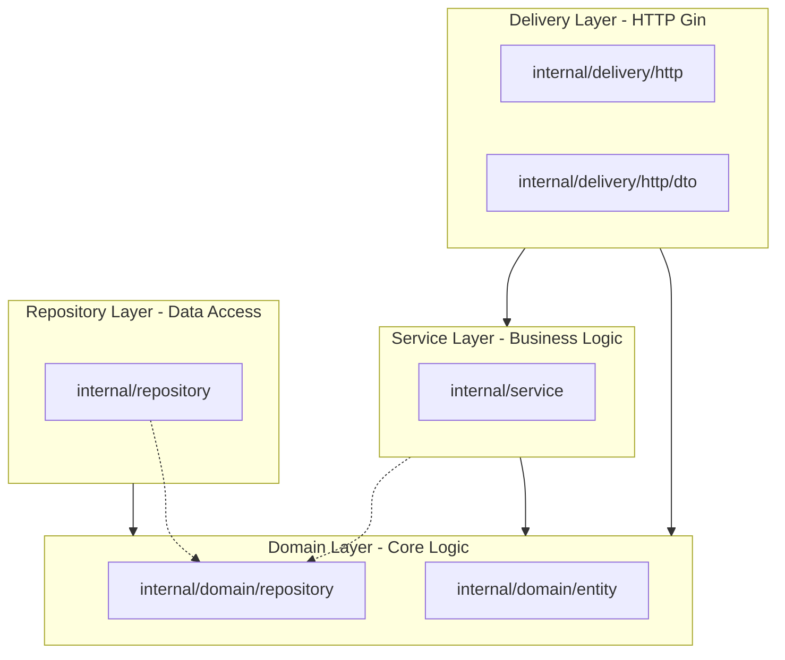

# KBank ECMS Project Structure & Architecture Guide

This document explains the organization and architectural layers of the **KBank ECMS (Rule Management)** repository. The codebase is structured using **Clean Architecture** principles coupled with **Uber Fx** for dependency injection.

---

## 📂 Repository Directory Layout

Here is an overview of the root directory and its primary modules:

```text
kbank-ecms-backend/
├── cmd/                                  # Application entry points (fx wiring)
│   ├── migrate/                          # Goose DB migrations & seeds CLI tool
│   ├── migrate-gen/                      # Utility for generating new migrations
│   ├── svc-cmc-backoffice/               # CMC Schema Mapping Service
│   └── svc-contstrat-backoffice/         # Content Strategy Rule Management API
├── configs/                              # YAML configuration profiles
├── deploy/                               # Deployment configuration templates (Docker, GCP, Kubernetes)
├── docs/                                 # API documentation, swagger assets, & architecture diagrams
├── internal/                             # Private application code (Clean Architecture layers)
│   ├── domain/                           # Layer 1: Pure business objects & repository contracts
│   │   ├── entity/                       # Domain models (e.g., attribute, rule, schedule)
│   │   └── repository/                   # DB/storage interfaces (abstract contracts)
│   ├── service/                          # Layer 2: Core business use cases & domain validators
│   ├── repository/                       # Layer 3: Database implementations (GORM Postgres, Redis, Azure)
│   ├── delivery/                         # Layer 4: Router, handlers, & middleware (HTTP Gin)
│   │   └── http/                         # DTO definitions, routing rules, & middleware
│   └── infrastructure/                   # Infrastructure setups (logging, observability)
├── pkg/                                  # Public shared utility packages
│   ├── auth/                             # JWT and authentication helpers
│   ├── config/                           # Configuration parser and structs
│   ├── ctxconsts/                        # Context constant helpers (request headers, user profiles)
│   ├── i18n/                             # Internationalization modules
│   └── util/                             # Generic helpers & string formatting functions
├── scripts/                              # Local setup, run, and development scripts
├── test/                                 # Test mocks & integration test suites
├── Makefile                              # Central project automation tasks (build, lint, test, db)
├── go.mod                                # Go dependency definitions
└── docker-compose.yml                    # Local dev environment stack (Postgres, Redis, Swagger)
```

---

## 🏛️ Architectural Layers

Following Clean Architecture, dependencies flow **inward**. Outer circles (like Delivery and Repositories) know about inner circles (Domain), but inner circles have absolutely zero dependencies or knowledge of outer layers.



### 1. Domain Layer (`internal/domain/`)
The absolute core of the application. It contains no external framework dependencies (no Gin, no GORM, no Redis).
*   **`entity/`**: Defines structures representing the business state (e.g., [Rule](file:///c:/KBank-ECMS-Backend/internal/domain/entity/rule.go), [Schedule](file:///c:/KBank-ECMS-Backend/internal/domain/entity/schedule.go), [User](file:///c:/KBank-ECMS-Backend/internal/domain/entity/user.go)).
*   **`repository/`**: Declares repository interfaces (contracts) describing how to load/save entities. The domain layer depends on these interfaces, which are implemented by the infrastructure layer (Dependency Inversion).

### 2. Service Layer (`internal/service/`)
Implements application-specific business rules. It coordinates entities and uses repository interfaces to fetch/persist state.
*   Handles validation logic (e.g., [AttributeValidatorService](file:///c:/KBank-ECMS-Backend/internal/service/attribute_validator_service.go)).
*   Orchestrates transactional tasks and background workers (e.g., [OccurrenceWorker](file:///c:/KBank-ECMS-Backend/internal/service/occurrence_worker.go)).

### 3. Repository Layer (`internal/repository/`)
Contains concrete implementations of the interfaces defined in the domain layer.
*   **Postgres / GORM**: Performs CRUD on database tables (e.g., [UserRepository](file:///c:/KBank-ECMS-Backend/internal/repository/user_repository.go)).
*   **Redis**: Implements caching, syncing, and state caching (e.g., [RedisRepository](file:///c:/KBank-ECMS-Backend/internal/repository/redis_repository.go)).
*   **Azure Storage**: Interacts with cloud storage for large artifacts or media assets.

### 4. Delivery Layer (`internal/delivery/http/`)
Exposes HTTP endpoints and communicates with clients.
*   **Handlers**: Parse client inputs, call services, and write JSON responses.
*   **`dto/`**: Defines serialization/deserialization models (Data Transfer Objects) for request parameters and responses, isolating service entities from API changes.
*   **`middleware/`**: Implements HTTP interceptors:
    *   `AuthMiddleware`: Extracts and validates JWT session tokens.
    *   `DbMiddleware`: Binds DB transactions to requests.
    *   `LoggerMiddleware`: Formats request-response terminal logging.

---

## ⚡ Dependency Injection with Uber Fx

Instead of manual initialization, this project utilizes **[Uber Fx](https://github.com/uber-go/fx)** for dependency injection (DI).

1.  **Entry Point**: Each microservice starts from `cmd/<service-name>/main.go` where `fx.New` constructs the container graph.
2.  **Modularization**: Inside each service folder (e.g., `cmd/svc-contstrat-backoffice/`), `module.go` defines FX modules linking constructors together:
    ```go
    var RepositoryModule = fx.Provide(
        repository.NewUserRepository,
        repository.NewRedisRepository,
        // ...
    )
    ```
3.  **Providers**: Local dependencies and client adapters (such as DB connections, GORM initialization, and Redis connections) are provided in `providers.go`.

---

## 🔐 Key Subsystems & Design Choices

### 1. JWT Authentication & Single-Session Constraint
*   **Activity Login Flow**: Implemented under `POST /token`, verifying a short-lived parent identity token and issuing an ECMS session JWT.
*   **Single-Session Enforcement**: On login, a hash of the current active session is stored in `login_token_history`. The `JWTMiddleware` validates incoming tokens and cross-references this table. A subsequent login generates a new token and invalidates the previous hash.

### 2. Cache Invalidation via Redis Pub/Sub
*   To keep distributed API nodes updated without restarting or completely flushing Redis, nodes publish validation triggers to the `cms:sync:ping` channel (e.g., [RedisRepository](file:///c:/KBank-ECMS-Backend/internal/repository/redis_repository.go)).
*   Subscribing nodes invalidate only the specific cached placement or decision rule referenced in the message.

### 3. Shared Packages (`pkg/`)
Utility code that does not fit into specific Clean Architecture layers:
*   [pkg/auth](file:///c:/KBank-ECMS-Backend/pkg/auth/): Pure cryptography and token parsing logic.
*   [pkg/config](file:///c:/KBank-ECMS-Backend/pkg/config/): Logic to read and marshal yaml settings to configuration structs.
*   [pkg/ctxconsts](file:///c:/KBank-ECMS-Backend/pkg/ctxconsts/): Safe context keys for request propagation (e.g. Request-ID, trace attributes).

---

## 🛠️ How to Add a New Feature

When adding new tables or business functions, follow this path:
1.  **Define Model**: Add a new entity file in `internal/domain/entity/`.
2.  **Define Contract**: Write repository interfaces in `internal/domain/repository/`.
3.  **Write DB Repository**: Create a postgres implementation in `internal/repository/`.
4.  **Write Use Case**: Add business logic in a new `internal/service/` file.
5.  **Write DTOs**: Create incoming/outgoing JSON models in `internal/delivery/http/dto/`.
6.  **Create API Handler**: Write a controller function under `cmd/<service-name>/handler/` or `internal/delivery/http/`.
7.  **Register Router**: Wire the route in `internal/delivery/http/router.go`.
8.  **Register in Fx**: Add constructor functions to the corresponding FX module in `cmd/<service-name>/module.go`.
