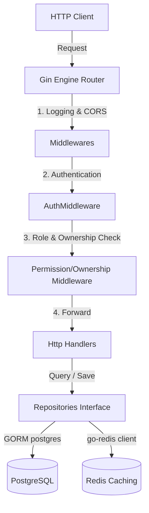
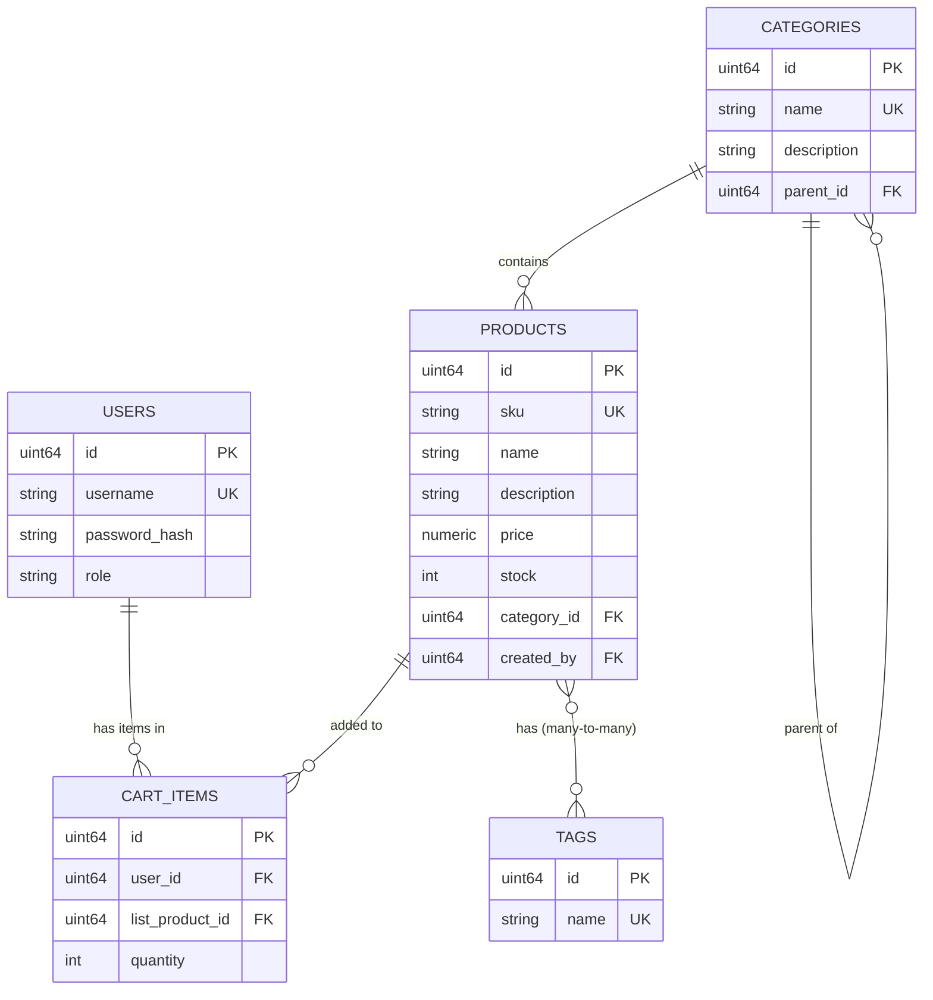

# Ecommerce Backend API

An extensible, high-performance ecommerce REST API built in Go utilizing clean architectural boundaries, automated database migrations, dependency injection, and caching.

---

## 🛠 Tech Stack

- **Language:** Go 1.26+
- **HTTP Framework:** [Gin Gonic](https://github.com/gin-gonic/gin) (v1.12)
- **Dependency Injection:** [Uber Fx](https://github.com/uber-go/fx) (v1.24)
- **Database ORM:** [GORM](https://gorm.io/) (v1.31)
- **Relational Database:** PostgreSQL 15
- **Cache / Ephemeral Store:** Redis 7 (Cart persistence & caching)
- **Schema Migrations:** [Atlas CLI](https://atlasgo.io/) & Goose Format migrations
- **API Documentation:** Swaggo / Gin-Swagger (OpenAPI 2.0 / Swagger 2.0)
- **Structured Logging:** Go standard library `log/slog`

---

## 🏗 Architecture & Directory Structure

The project strictly follows **Clean Architecture** principles decoupled with **Uber Fx** for dependency injection.

### Architecture Flow



### Architectural Layers

1. **Entity (`internal/domain/entity`)**: Standard domain models (User, Product, Category, Tag, CartItems) independent of external frameworks.
2. **Repository (`internal/domain/repository` & `internal/repository`)**: Abstract interfaces and concrete database implementations (GORM for PostgreSQL, Redis client for Cart).
3. **Delivery (`internal/delivery/http`)**: Manages HTTP handlers, JSON validation/binding, token parsing, and permission checks.

### Directory Layout

```
Ecommerce-Backend/
├── cmd/
│   ├── api/                  # Main HTTP application entry point
│   └── atlas-loader/          # Loader utility for Atlas schema representation
├── docs/                      # Swagger docs & design specifications
├── internal/
│   ├── db/                    # Database connection, Redis client & Atlas migrations
│   ├── delivery/
│   │   └── http/              # HTTP Handlers & Route definitions
│   │       └── middleware/    # Auth, Permission, CORS, & Slog middlewares
│   ├── domain/
│   │   ├── entity/            # Domain model structs
│   │   └── repository/        # Repository interfaces
│   └── repository/            # Concrete database repository implementations
├── pkg/
│   └── auth/                  # Shared JWT authentication helper utilities
├── atlas.hcl                  # Atlas schema migration config
├── docker-compose.yml         # Local Docker environment configuration
├── Makefile                   # Automation commands for migrations and server
└── go.mod                     # Go modules dependency declaration
```

---

## 🗄 Database Schema Design



---

## 🚀 Local Development & Setup

### Prerequisites

- [Docker & Docker Compose](https://www.docker.com/)
- [Go (v1.26+)](https://go.dev/)
- [Atlas CLI](https://atlasgo.io/getting-started/) (for database migrations)

### 1. Clone & Infrastructure Launch

Start PostgreSQL and Redis services via Docker Compose:

```bash
docker compose up -d
```

### 2. Environment Configuration

Create or update your `.env` configuration file in the project root:

| Environment Variable | Description | Default / Example |
| :--- | :--- | :--- |
| `PORT` | HTTP server port | `8080` |
| `DB_HOST` | PostgreSQL host | `localhost` |
| `DB_PORT` | PostgreSQL port | `5432` |
| `DB_USER` | PostgreSQL user | `postgres` |
| `DB_PASSWORD` | PostgreSQL password | `postgres` |
| `DB_NAME` | PostgreSQL database name | `ecommerce_db` |
| `DB_SSLMODE` | SSL Mode for PostgreSQL | `disable` |
| `REDIS_ADDR` | Redis host & port | `localhost:6379` |
| `REDIS_PASSWORD` | Redis password | `""` |
| `REDIS_DB` | Redis database index | `0` |
| `JWT_SECRET` | Secret key for signing JWT tokens | `your-secret-key` |
| `RUN_MIGRATIONS` | Automatically run GORM auto-migrations on boot | `true` |

### 3. Database Migrations

Atlas CLI manages schema versioning located in `internal/db/migrations`. Useful commands in `Makefile`:

```bash
# Run pending migrations
make migrate-apply

# Check current migration status
make migrate-status

# Generate a new migration diff
make migrate-diff name=<migration_name>

# Re-hash migration directory checksums
make migrate-hash
```

### 4. Running the Application

```bash
go run cmd/api/main.go
```

---

## 📚 API Documentation & Security Flow

### Swagger API Documentation

Interactive Swagger documentation is available when running the API server:
- **URL:** `http://localhost:8080/swagger/index.html`

To regenerate Swagger docs after modifying handlers:

```bash
swag init -g cmd/api/main.go
```

### Authentication & Permissions Matrix

All protected endpoints require a `Bearer <token>` HTTP Header.
- `RequirePermission(roles...)`: Restricts access based on user role (`admin`, `seller`, `customer`).
- `RequireOwnership(...)`: Restricts modification/deletion to the creator of the resource or an admin.

| Method | Endpoint | Description | Auth Required | Allowed Roles |
| :--- | :--- | :--- | :---: | :--- |
| `POST` | `/register` | Register a new user | ❌ | Anyone |
| `POST` | `/login` | Authenticate & obtain JWT | ❌ | Anyone |
| `GET` | `/products` | List all products | 🔑 | `admin`, `seller`, `customer` |
| `GET` | `/products/:id` | Get details of a product | 🔑 | `admin`, `seller`, `customer` |
| `POST` | `/products` | Create a new product | 🔑 | `admin`, `seller` |
| `PUT` | `/products/:id` | Update a product | 🔑 | `admin`, `seller` *(ownership)* |
| `DELETE` | `/products/:id` | Delete a product | 🔑 | `admin`, `seller` *(ownership)* |
| `POST` | `/cart/add` | Add items to shopping cart | 🔑 | `admin`, `seller`, `customer` |
| `GET` | `/cart` | View shopping cart items | 🔑 | `admin`, `seller`, `customer` |
| `POST` | `/product-categories` | Create product category | 🔑 | `admin` |
| `GET` | `/product-categories` | List product categories | 🔑 | `admin`, `seller`, `customer` |
| `GET` | `/product-categories/:id` | Get category by ID | 🔑 | `admin`, `seller`, `customer` |
| `PUT` | `/product-categories/:id` | Update category | 🔑 | `admin` |
| `DELETE` | `/product-categories/:id` | Delete category | 🔑 | `admin` |
| `POST` | `/product-tags` | Create product tag | 🔑 | `admin` |
| `GET` | `/product-tags` | List product tags | 🔑 | `admin`, `seller`, `customer` |
| `GET` | `/product-tags/:id` | Get tag by ID | 🔑 | `admin`, `seller`, `customer` |
| `PUT` | `/product-tags/:id` | Update tag | 🔑 | `admin` |
| `DELETE` | `/product-tags/:id` | Delete tag | 🔑 | `admin` |
