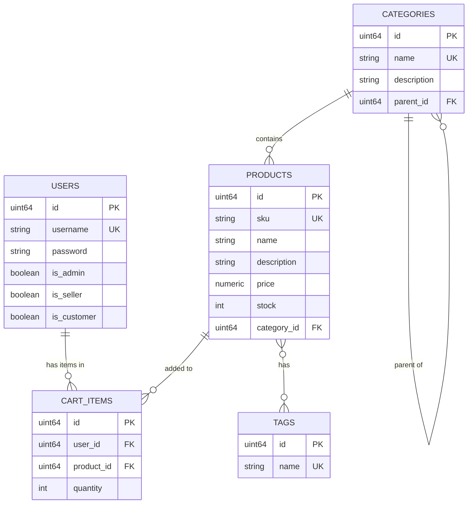

# E-Commerce Database & API Design Specification

**Date**: 2026-06-17  
**Status**: Approved

---

## 1. Goal Description
To design and implement a relational database schema for an e-commerce catalog featuring hierarchical categories (subcategories), product tags, and a direct shopping cart model.

---

## 2. Database Schema Design
We are implementing **Approach 2 (Hierarchical Catalog with Many-to-Many Tags)** with a **Direct Shopping Cart** association (linking cart items directly to users without an intermediate carts table for simplicity and performance).

### Schema ERD Diagram

---

## 3. Key Architecture Decisions

### A. Hierarchical Categories
The `categories` table utilizes a self-referencing foreign key (`parent_id`) pointing to `categories.id`. This enables nested categories (e.g., `Apparel -> Men's -> Shoes`).

### B. Direct Cart Items
Since each user has exactly 1 active cart, `cart_items` connects directly to the `user_id`, reducing table joins and storage overhead.

### C. Permissions (User Roles)
Authentication permissions are migrated to a role-based access model (`IsAdmin`, `IsSeller`, `IsCustomer`) validated by the HTTP JWT middleware.

---

## 4. Verification Plan
- Compiles successfully with Uber Fx injection.
- Endpoint validation:
  - `POST /products/` (Requires Admin/Seller role)
  - `GET /products/` (Accessible by all verified roles)
  - `PUT /products/:id` (Requires Admin/Seller role)
  - `DELETE /products/:id` (Requires Admin/Seller role)
